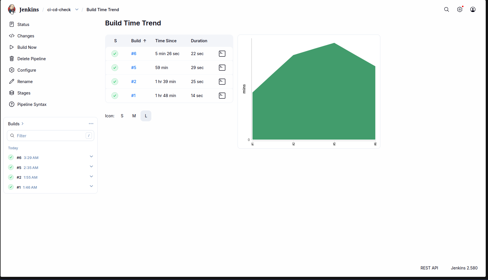

# ci-cd-check

Simple Flask application used to test a GitOps CI/CD workflow with Jenkins, Docker, Kubernetes, and Argo CD.

## Workflow

1. Jenkins builds the Docker image (`mimo017/ci-cd-check:<build_number>`).
2. Jenkins pushes the image to Docker Hub.
3. Jenkins updates the Kubernetes manifest repository with the new image tag.
4. Argo CD detects the manifest change and syncs it to the Kubernetes cluster.

## Manifest Repository

Manifest repository: [ci-cd-check-manifest](https://github.com/mimo-to/ci-cd-check-manifest)

## Deployment Flow

```text
Source Code Repo (ci-cd-check)
           ↓
    Jenkins Pipeline
           ↓
       Docker Hub
           ↓
Manifest Repo (ci-cd-check-manifest)
           ↓
        Argo CD
           ↓
 Kubernetes Cluster (Minikube)
```

## Screenshots

### Jenkins Pipeline Build


### Argo CD Sync

